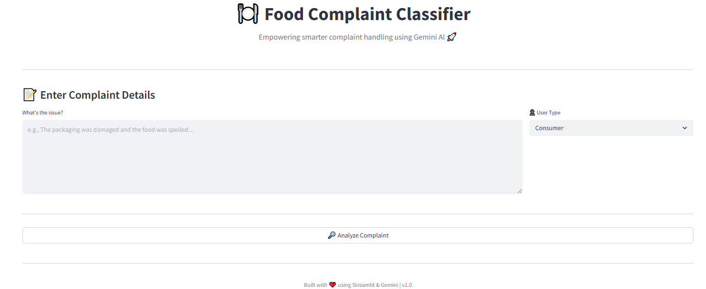

# 🍽️ Food Complaint Classifier

An intelligent food complaint classification app powered by **Gemini AI**. This web application processes user complaints and returns structured metadata such as department, category, priority level, keywords, and emergency flags – making complaint management smarter and faster.

 <!-- Replace with your actual screenshot path -->

---

## 🚀 Features

- 🔍 Classify food complaints based on user input
- 🧠 Uses **Google Gemini 1.5 Pro** for accurate classification
- 📌 Extracts:
  - Relevant department
  - Complaint category
  - Priority level (HIGH / MEDIUM / LOW / URGENT)
  - Important keywords
  - Emergency flag
- 📊 Clean, interactive UI built with **Streamlit**
- 📦 Lightweight and easy to deploy

---

